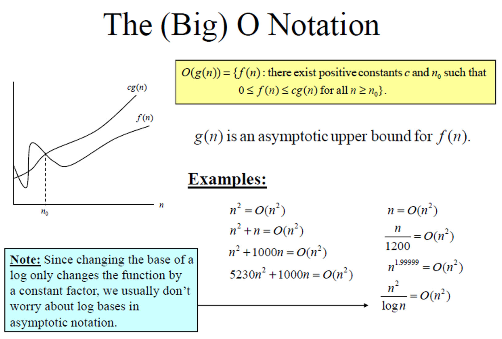

# Асимптотична сложност

Използва се при изследването на времето на изпълнение и/или използваната памет на дадена програма, които се разглеждат като функция на входния размер.
С асимптотичното поведение на фукнкция `f(n)` свързваме поведението на тази функция, когато `n` добива някакви големи стойности. Това означава, че за такива големи стойности на `n`, примерната функция `f(n) = c1 * n + d1` е винаги асимптотично по-добра от функция `g(n) = c2 * n^2 + d2`. Това ,обаче, не е задължително за малки стойности на `n`, а именно ако стойностите на `c2` и `d2` са значително по - малки от съответно `c1` и `d1`.

## Big O нотация (big omega, big theta)
За да проверим кой алгоритъм(или операция) е по-добър не е достатъчно просто да измерим времето. Има няколко причини за това - на различни машини отчетеното време ще е различно, а освен това за бързи алгоритми тези измервания на времето може да не са достатъчно прецизни. Вместо това разглеждаме броя прости операции, които трябва да бъдат извършени от компютъра.

### Формални дефиниции

* Big O  
  
* Big Omega  
  
* Big Theta  
  

Казано по друг начин голямо-О ни дава горна граница на сложността в най - лошия случай, т.е. на максималния брой операции, които могат да се извършат.
В таблицата отдолу са записани различните класове функции, които могат да бъдат срещнати.

Big O нотация| Порядък на ръстеж
:---: | :---:
O(1)|константна
O(log n)|логаритмична
O(n)|линейна
O(n log n)|"n log n"
O(n^2)|квадратична
O(n^3)|кубична
O(n^c)|полиномиална
O(c^n)|експоненциална

## Полезни ресурси

* [Big O notation](http://web.mit.edu/16.070/www/lecture/big_o.pdf)
* [Big O cheat sheet](https://www.bigocheatsheet.com/)
